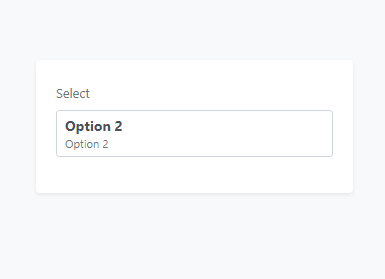
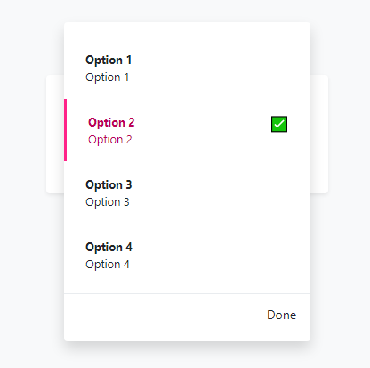

# edd-select

## Project setup
```
npm install
```

### Compiles and hot-reloads for development
```
npm run serve
```

### Compiles and minifies for production
```
npm run build
```

### Customize configuration
See [Configuration Reference](https://cli.vuejs.org/config/).

### Note
this library is using bootstrap 4.4.1 and @popperjs/core

maybe in the next version i'll remove the bootstrap from it, and add some features :fire: and fix some bugs :poop:

### To Use
:warning: i've been not done with this library, so please do not to use to your project







##### Browser
Download the dist folder 📁 then call it from html file

```html
    <link rel="stylesheet" href="./dist/edd-select.css">
    <script src="./dist/edd-select-umd.min.js">
```

##### Vue Cli
download the **components/EddSelect.vue** file

##### Usage
```html
    <!-- on html -->
    <edd-select v-bind="options"/>
```
```javascript
    // on script
    const EddSelect = window["edd-select"].EddSelect;
    Vue.components('edd-select', EddSelect);
    new Vue({
        data: {
            options: [
                { id: "1", label: "Apple 🍎" },
                { id: "2", label: "Banana 🍌" }
            ]
        }
    })
```

### todo:
1. add responsive
2. auto-scroll when it has a lot option
3. remove bootstrap classes, (change to  standalone css)
4. add disabled option feature
5. add some feature to placement

### Need Feedback
this is my first library, i know it's not even close to good or even perfect, but i still need your sugestions and critics to be better than the past


🗺 Lasiana, Kupang, East Nusa Tenggara, Indonesia